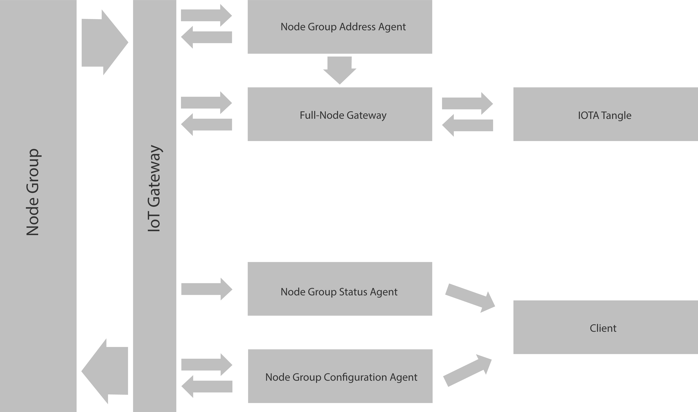

# Specifications for IINP: IOTA IoT network protocol

## Preconditions

### Wording

The key words "MUST", "MUST NOT", "REQUIRED", "SHALL", "SHALL NOT", "SHOULD", "SHOULD NOT", "RECOMMENDED",  "MAY", 
and "OPTIONAL" in this document are to be interpreted as described in [RFC 2119](http://www.ietf.org/rfc/rfc2119.txt).

### CAP
In sense of the CAP theorem, this specification prefers availability and partion tolerance over consistency. 
It is designed to be eventual consistent.

### Usage of the Specifications

This Specification is UNSTABLE. It SHALL not be used for production implementations.

## Naming Convention

The following naming convention SHALL be used in the implementation. 
The naming convention within the implementation MUST be CamelCase or Underscore _.

## Communication

This network specification requires a mesh-network topology. 

### Node

A Node MUST be one physical device. A Node SHOULD be an embedded device.

#### Properties

###### Node Class

The value SHALL be Sensor Node or Payment Node.
Every Node MUST have a Node Class.

###### Node Type

The value SHALL be Seed Node, Worker Node or Temporary Node.
Every Node MUST have a Node Type.

###### Node ID

Each Node MUST have its own Node ID.
The value of the Node ID SHALL be unique within a Node Group.

#### Other

###### Sensor Node

A Sensor Node SHOULD be a small embedded device.
It MUST collect any data about the surrounding environment.

###### Payment Node

A Payment Node SHOULD be a small embedded device. 
A Payment Node is REQUIRED to send or/and accept IOTA payments.
It SHOULD give access to services or goods.

###### Area Width

Every Node Group MUST have a Area Width.
The Area Width MUST be the longest distance between two Nodes within a Node Group.
The Area Width MUST be a circle.

###### Node Group

A Node Group MUST be group of Sensor- and/or Payment Nodes. 
They MUST fulfil the same or similar purpose. 
All Nodes within a Node Group MUST be in an Area Width.

###### Node Group Member

A Node Group Member SHALL be the name of a Node within a Node Group.

###### Seed Node

A Seed Node MUST be a Node within a Node Group.
It MUST holds the configuration for new Node Group Members. 
It also MUST collect the status of the Node Group for a Node Group Status Agent.

###### Worker Node

A Worker Node MUST be Node Group Member which is not a Seed Nodes.

###### Temporary Node

A Temporary Node MUST be a temporary member in a node group. 

###### Node Group Neighbor

All other Nodes within a Node Group SHALL be called Node Group Neighbor.

### IoT Gateway

A IoT Gateway MUST forword the IINP package to the correct and responsible service.

### Full-Node Gateway

A Full-Node Gateway SHALL give a Node Group Member indirect access or direct to the tangle.

### Node Group Configuration Agent

A Node Group Configuration Agent SHOULD be a more powerful embedded device or it SHOULD be a server.
It MUST manage one or more Node Groups.

### Node Group Address Agent

A Node Group Address Agent MUST manage all addresses and transactions broadcasted by one or more Node Groups.

### Node Group Status Agent

A Node Group Status Agent MUST manage the status of one or more Node Groups.

### Group Status Codes

###### HEALTHY

The Status HEALTHY MUST be broadcasted by a Seed Node, if everything operates in the specified way.

###### DEAD

The Status DEAD MUST be broadcasted by a Seed Node if all of the reachable Node Group Members are DEAD.

###### PARTIALLY_BROKEN

The Status PARTIALLY_BROKEN MUST be broadcasted by a Seed Node, if the status of, at least one, of the reachable Node Group Member is BROKEN or DEAD.

###### QUORUM_BROKEN

The Status QUORUM_BROKEN MUST broadcasted by a Seed Node, if the status of a quourum count of the reachable Node Group Members is BROKEN.

###### QUORUM_DEAD

The Status QUORUM_DEAD MUST broadcested by a Seed Node, if the status of a quourum count of the reachable Node Group Members is DEAD. 
QUORUM_DEAD MUST overrule the status QUORUM_BROKEN.

### Node Status Codes

###### HEALTHY

The Status HEALTHY MUST be broadcasted by Node, if everything operates in the specified way.

###### DEAD

The Status DEAD MUST be broadcasted by a Nodes Node Group Neighbors for a Node Group Member, 
if it cannot contact this Node Group Member directly or indirect anymore or if it doesn't receive broadcasts by this node anymore.

###### BROKEN

The Status BROKEN MUST be broadcsted by a Node, if the Node is still available but not able to fulfil its purpose.

### IOTA Tangle Network

###### IOTA Address

An IOTA Address MUST be the ternary char presentation of an address which is used on the IOTA tangle.
Once generated and IOTA address MUST be saved persistent on a Node. The wire format MUST be the byte ternary representation.

###### IOTA Transaction

An IOTA Transaction MUST be a transaction on the IOTA tangle. It SHOULD be a confirmed transaction. 

###### IOTA Address Milestone

An IOTA Address Milestone MUST be an ID for a given IOTA Address which MUST be set by a Node Group Address Agent
It SHALL NOT be set by a Node Group Member.
An IOTA Address Milestone SHALL be only contain A-Z & 0-9.
The Node Group Address Agent MUST save the IOTA Address Milestones persistently for all known addresses in a Node Group.

###### Seed Key

A Seed Key is the private IOTA Seed which is used as base for generating IOTA addresses, transactions etc. 
It is also known just as seed in the IOTA specifications.

### Communication

#### IoT Gateway

###### Health Status Request
 
A Health Status Request MUST be used by a IoT Gateway to get the health of a Node Group.
An IoT Gateway MUST send the Health Status Request in an interval.

###### Health Status Response

The Health Status Response MUST contain the following information:
- Status: BROKEN, HEALTHY or DEAD

###### Status Refresh Request

A Status Refresh Request MUST be used by a IoT Gateway to get information about the Node Group.
An IoT Gateway MUST send the Status Refresh Request in an interval.

###### Status Refresh Response

The Status Refresh Response MUST contain the following information:
- Current used addresses
- Prices of the services, sensor data or goods
- New added Member, if there were any between current status call and last one.

#### Nodes

###### IOTA Address Transactions Update Request

An IOTA Address Transactions Update Request SHALL be send by a Node which is interested in a new transaction. 
It MUST , at least, contain the following information:
- Latest Milestone

## Functional description

### Communication

Nodes SHALL communicate peer to peer within their Node Group. 
Nodes within one Node Group SHALL NOT be able to communicate with Members of another Node Group. 
Each Node Group Member MUST also be able communicate to one or more IoT Gateway.

##### Node Group Address Agent <-> IOTA Tangle

A Node Group Address Agent MUST subscribe to the transaction feed of all known IOTA Addresses. 
The Node Group Address Agent MUST receive all incoming transactions of these IOTA Addresses. 
The Node Group Address Agent MUST cache these transactions.
The Node Group Address Agent SHOULD delete the entry in the cache after a quorum of the reachable Node Group Members received the transaction.
A Node Group Address Agent MUST broadcast every transaction through a Gatway. It MUST broadcast the transaction when it receives a new one.

##### IoT Gateway <-> Node Group Status Agent  

###### Health Status

The Node Group Status Agent MUST receive Health Status messages broadcasted by the Node Group Members.

##### Seed Nodes <-> Node Group Status Agent

###### Node Group Status

A Seed Node MUST broadcast the Node Group Status in an interval. This status contains the following information:
- List of all Node Group Member which are reachable by the Seed Node. And the corresponding status of each Member.
- List of all other Seed Nodes and the corresponding status.

#### Seed Node <-> Seed Node communication

###### Seed Node Gossip

Every Seed Node MUST request the Seed Node Gossip in an interval from the other Seed Nodes. 
It SHOULD do it every x seconds. 
The Node which requests the newest Seed Node Gossip selects a random Seed Node Neighbor. 
This Seed Node Neighbor SHOULD respond to this request. 
If it does not respond to this request, SHOULD be marked as DEAD. 
The Seed Node Gossip Response MUST contain the following information:
- Latest known transactions since the last milestone.
- Latest known milestone
- Its own status
- New added Worker Nodes (a new Worker Node SHOULD be deleted from this response after x hours.)

If a Seed Node detected an issue on its side, it MUST response with a BROKEN status within the Seed Node Gossip.

The SeedNodes SHOULD retry contacting the not responding Seed Node. They SHOULD do it several times with a timeout.
The Seed Node which is not responding MUST mark, eventually, as DEAD if it is not responding.

#### Node Group Member <-> Node Group Member communication

###### Node Group Member Gossip

Every Node Group Membster MUST broadcast the Node Group Member Gossip in an internval.
It MUST include its own status in this broadcast package.
The Node Group Member Gossip MUST contains the following information:
- Latest known transactions since the last milestone.
- Latest known milestone.
- Its own status

#### Worker Node <-> Seed Node communication

###### Worker Node Gossip

Every Worker Node MUST broadcast all information starting from the last milestone of an address.
It must also broadcast all Worker Nodes starting from the last Node Group milestone.

#### Node Group Member Registration

###### Add a Worker Node to an existing Node Group

If a new Worker Node gets added to an existing Node Group, 
it MUST request a list of all existing Seed Nodes by a Node Group Control Agent through an IoT Gateway.
It MUST communicate to this given Seed Nodes and MUST gives them all necessary information to operate within the Node Group. 
At least one Seed Node MUST response with all necassary information for the new added Node Group Worker Node.
At least one Seed Node MUST also response with a list of all existing Worker Node of the Node Group.

###### Creation of a new Node Group

A new Node Group MUST be added to a Node Group Configuration Agent. A new Node Group SHALL NOT be created by a Node itself. 
The first Member of a new created Node Group MUST be a Seed Node. 
The Member of the created Node Group MUST request a IoT Gateway for initial configuration.

###### Add a new Seed Node

Like the creation of a new Node Group, a Seed Node MUST be added to a Node Group through an Node Group Configuration Agent. 
After adding a new Seed Node to a Node Group Configuration Agent, the new added Seed Node MUST get the initial configuration by the Node Group Configuration Agent. 
It MUST also register itself to all of its Node Group Neighbor Seed Nodes. 
It MUST provide all necessary information to operate within the Node Group. 
The already active Seed Nodes MUST receiving the request of the new Seed Node. 
They MUST request a Node Group Configuration Agent for the new Node Group NodeSeed list. 
They MUST check if the new Seed Node is in this list. 
If the list does not contain the new Seed Node, they MUST retry requesting the seed list. 
They SHOULD do it x times. They SHOULD do it with a timeout. 
This time SHOULD be x seconds. 
If the Seed Node is still not in the list, they SHOULD ignore all of the new Seed Nodes requests.

#### Seed Keys

A Seed Key MUST generated by the Node itself. 
It SHALL NOT share this Seed with other Nodes. 
It MUST keep this Seed Key secure in its storage. 
Seed Keys MUST be saved persistent.
It MUST also keep track of the current used IOTA Address' index.

#### Generation of IOTA Addresses

Since a Seed Key is used to generate IOTA Addresses, the IOTA Address MUST be generated on the Node.
Generation of IOTA Addresses in chunks is OPTIONAL.

#### Receiving an IOTA Address' transactions

The Node Group Member which is intersted in an incoming transaction of a specific Address MUST 
subscribe to the Addresses index. The Node Group Member must also provide a specific Address Milestone.
The response MUST include all transactions since the given Transaction Milestone. 
The response MUST contains all new available transactions since the given Address' Milestone. 
The latest transaction SHALL be marked with the latest Milestone. The Node Group Address Agent MUST handle the marking of Milestones.
To get the IOTA Addresses' transactions, the Node SHOULD subscribe via a IoT Gateway. 
The IoT Gateway MUST forward this subscription to the Node Group Address Agent.
It is OPTIONAL to also subscribe to the Node Group Neighbors. 
A Node Group Member SHOULD also be able to force its Node Group Neighbors to forword its subscription to any IoT Gateway. 
The Node Group Address Agent or Node Group Neighbors response MUST contain the latest Address Milestone and all transactions between the provided Milestone and the latest. 
If the Node Group Member is not interested in a transaction, but receives ones through a IoT Gateway, 
it MUST forewords the information to the Node Group Member which subscribes to this address.

#### Receiving new IOTA Addresses

Node Group Address Agent SHALL receive new IOTA Addresses by the Node Group Members.
It MUST also take care about the address indicies of each Node Group Members.

#### Promotion of an IOTA transaction

The Node Group Address Agent MUST take care of promoting an IOTA transactions created by a Node.

### Reattachment of an IOTA transaction

The Node Group Address Agent MUST take care of reattaching an IOTA transaction created by a Node.

### Proof of Work

The Node Group Address Agent MUST take care of the Proof of Work for an IOTA transaction created by a Node.

### Trunk- & Branch-Transaction

The Node Group Address Agent MUST take care of picking the Trunk- & Branch-Transaction-Bundles.

### Access Data, Services or Goods

#### Receiving Payments as Payment Node

